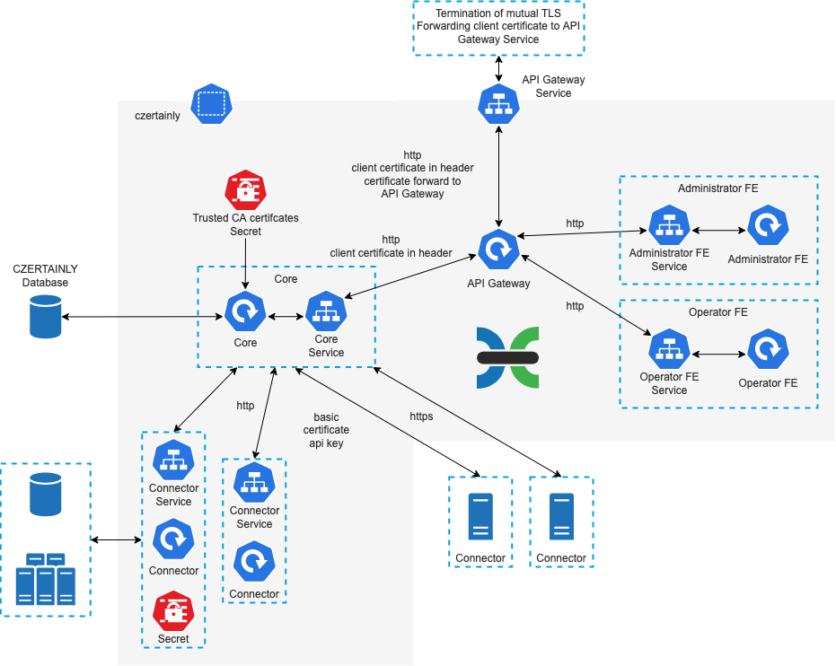

# Introduction

One of the approaches we have adopted from the beginning of development of the platform is easy installation and deployment. We believe that you should not spend weeks or even months working on the configuration before starting to use the platform.

Therefore, we have adopted a container-based approach and prepared a docker images and related documentation. With this you can easily and in short time deploy the platform and required connectors and services.

## Kubernetes deployment

The following diagram represents the deployment of the platform in Kubernetes. Because platform is composed of microservices and offers flexible approach to fit into each infrastructure, Kubernetes and containers are considered as basic implementation blocks. The deployment can be further extended by specific Kubernetes implementation supported in the target environment (for example [Istio](https://istio.io/) service mesh).

## Installation steps

Independently of the installation and deployment options, you need to follow the steps below to get the platform up and running:

| Step                                   | Description                                                               | Reference                                                  |
|----------------------------------------|---------------------------------------------------------------------------|------------------------------------------------------------|
| 1. Prepare the database                | Install and crate a database to be used by the platform.                  | [Database setup](database-setup)                           |
| 2. Create Trusted Certificates         | Create set of trusted certificates for the platform.                      | [Create Trusted Certificates](create-trusted-certificates) |
| 3. Deploy the platform                 | Deploy the platform using the docker images and the Kubernetes manifests. | [Deployment options](deployment/deployment-options)        |
| 4. Configure first Super Administrator | Create a Super Administrator and configure the platform.                  | [Create Super Administrator](create-super-administrator)   |

Once the first administrator is created, you can access the Administrator Interface.
Use the following URL with the client certificate authentication (first administrator):
`https://[domain]:[port]/administrator`

After successfully logging in, you can start administering and using the platform.

:::info Changing administrator web base URL context
You can change the base URL of the administrator web interface. By default, the `/administrator` is used.
:::